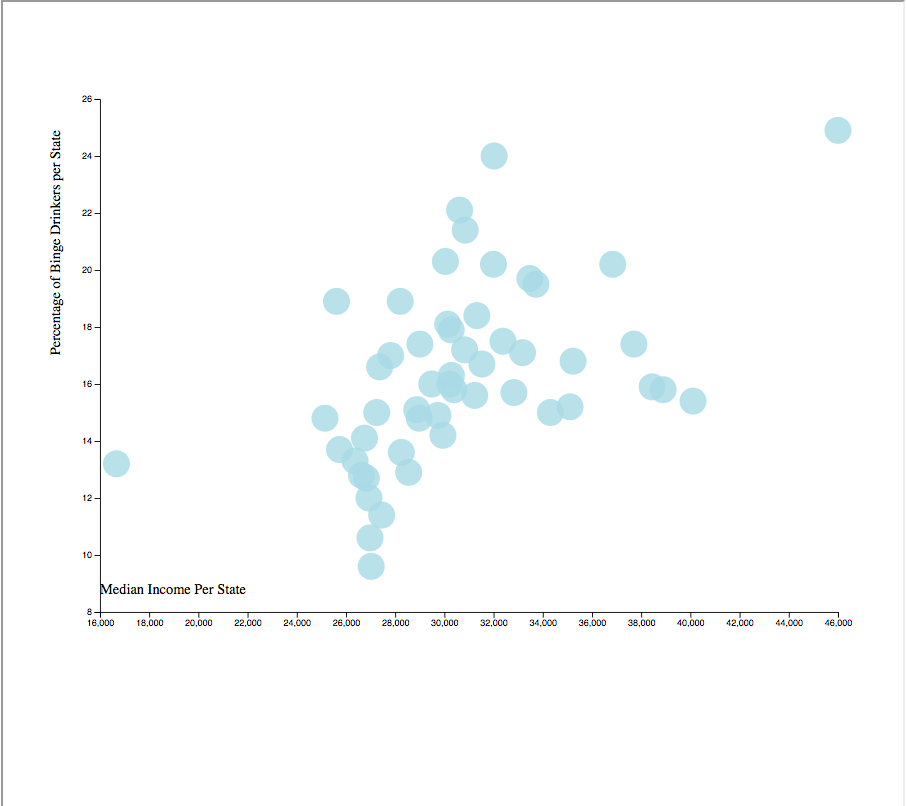

Unit 16 | Assignment - Data Journalism and D3

In this project I compared two sets of data from the U.S. Census Bureau's American Community Survey and the Behavioral Risk Factor Surveillance System. These datasets from 2014 had to have at least a 50 percent correlation in figures according to the Microsoft Excel Correl() function. I searched these databases until
I found a match.

I ended up using median income by state, and the percent of binge drinkers in the state's population.

Using d3 in javascript, I completed a scatter plot measuring this data complete with popups describing the data for each point.

